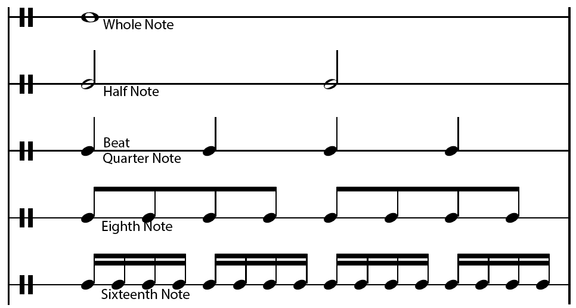
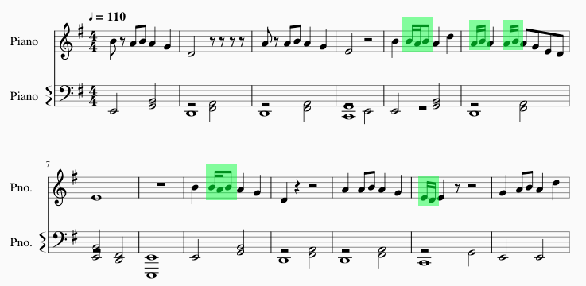
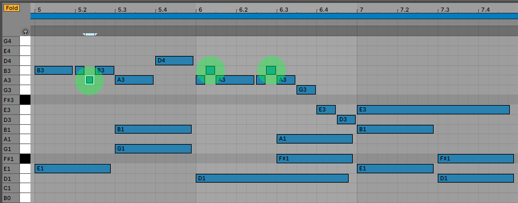

# Over The Wire - Advent Calendar CTF 2019

## Musical Steganography

We are given an audio file containing music, a Musescore sheet music file, a midi file, and several hints.
Of the hints, most importantly:
>If you don’t know music, it’s enough to know these concepts:
>- Major scale: https://en.wikipedia.org/wiki/G_major
> - How rhythm works, such as https://en.wikipedia.org/wiki/Eighth_note
> 
> The challenge is tagged as a “stegano” but it’s actually very different from an image stegano - the point of an image stegano is to hide information in a way that does not affect the appearance of the image; this music stegano would **sound different** if the flag’s contents were changed.
> 
> The flag format is AOTW{} and **that wrapper part is embedded in the music** as well.


---
## On Musical Scales
Chromatic Scale (12 Notes):
> C, C#, D, D#, E, F, F#, G, G#, A, A#, B

Major Scales follow the format:
> W W H W W W
>
> Where W is a **whole step** (skip a note in chromatic scale), and H is a half step (go directly to next note in chromatic scale)
>
> Major (and minor) scales have 7 notes.

G Major Scale (7 Notes)
> G, A, B, C, D, E, and F♯

We can treat notes in the G Major Scale as base 7, starting with G = 0

| | | | | | | | | | | | | | | | | | | |
|-|-|-|-|-|-|-|-|-|-|-|-|-|-|-|-|-|-|-|
|C|C#|D|D#|E|F|F#|G|G#|A|A#|B|C|C#|D|D#|E|F|F#|
|C|  |D|  |E| |F#|G|  |A|  |B|C|  |D|  |E| |F#|
|3|  |4|  |5| |6 |0|  |1|  |2|3|  |4|  |5| |6 |

---
## On Musical Rhythm









```python
from mido import MidiFile
import mido as mido

notes = []
midi_file = MidiFile('Stegno.mid')
track = mido.merge_tracks(midi_file.tracks)
ticks_beat = midi_file.ticks_per_beat

tempo = 0
notes = []
play_time = 0
for msg in track:
    msg_dict = msg.dict()
    play_time += msg_dict.get('time')
    if msg_dict.get('type') == 'set_tempo':
        tempo = msg_dict.get('tempo')
    if msg_dict.get('velocity') != 0 and msg_dict.get('type') == 'note_on' and (play_time % ticks_beat)/(ticks_beat/4) % 2 != 0:
        notes.append(chromatic_scale.get(msg_dict.get('note') % 12))
```